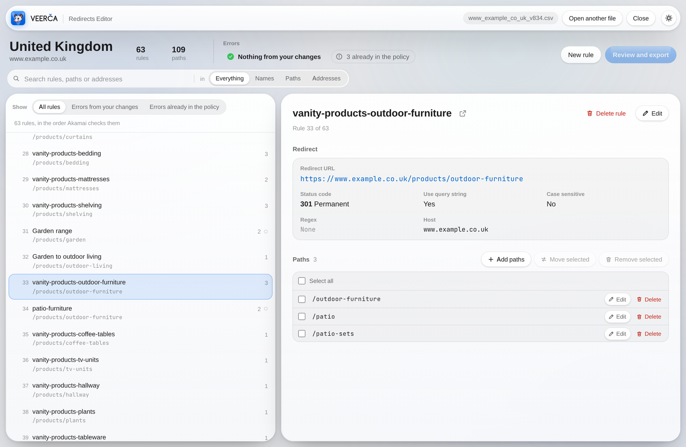

<p align="center">
  <picture>
    <source media="(prefers-color-scheme: dark)" srcset="docs/veerca-hero-dark.png">
    
  </picture>
</p>

<p align="center">
  <b>Open, check, edit and export Akamai Edge Redirector policies, right in your browser.</b><br>
  Nothing to install &nbsp;·&nbsp; no account &nbsp;·&nbsp; nothing leaves your computer
</p>

<p align="center">
  <a href="https://k-matyas-builds.github.io/veerca-redirects-editor/"><b>Open Veerča →</b></a>
</p>

<p align="center">
  <picture>
    <source media="(prefers-color-scheme: dark)" srcset="docs/veerca-screenshot-dark.png">
    
  </picture>
</p>

---

## Quick start

1. **Get the latest policy.** Ask whoever manages your Akamai configuration for the current export. It's a zip such as `Policy12345Version329.zip`, or the CSV inside it.
2. **Open it.** Go to **[k-matyas-builds.github.io/veerca-redirects-editor](https://k-matyas-builds.github.io/veerca-redirects-editor/)** in Chrome or Edge and drop the file on the page.
3. **Make your changes.** Add or edit rules and paths. Anything you need to fix shows in red.
4. **Export.** Click **Review and export**, then **Copy summary** and **Download CSV**.
5. **Send it back.** Send the CSV, with the summary, to be imported into Akamai.

## What you can do

- **Browse the whole policy.** See every rule in the order Akamai checks them, and search across rule names, paths and addresses.
- **Edit quickly.**
  - Change any rule's settings, or add rules.
  - Add paths in bulk: paste a list, and full addresses become paths.
  - Tick paths, or **Select all**, to move or remove them together.
  - Undo per rule. Moved paths go back to where they came from.
- **Work in several tabs.** Ctrl-click (⌘-click on a Mac) any rule to open it on its own page. All tabs stay in sync.
- **Catch mistakes before they go live.** Every change re-checks the whole policy for:
  - duplicate rule names;
  - paths that never take effect because an earlier rule already handles them;
  - redirect loops and redirect chains;
  - malformed paths and addresses;
  - Akamai's per-rule size limit.

  Many problems have a one-click fix.
- **Export cleanly.** You get a plain-language summary of your changes, a suggested file name such as `www_example_com_v330.csv`, and a CSV in the same layout you opened. Rules you didn't touch are written exactly as they were read.

## Good to know

- **Your work is saved in your browser as you go.** The start screen lists recent policies, one per site, so you can carry on later. The list belongs to that browser on that computer: colleagues don't see it, and clearing browser data removes it.
- **Errors you cause block export. Problems already in the file don't**, except a rule over Akamai's size limit, because Akamai would refuse the whole file.
- **Akamai accepts at most 8,192 characters of paths per rule.** A counter appears from 7,000. Near the limit, Veerča offers a second rule for the same address and can move the extra paths there in one click.
- **Rule names must be unique.** A second rule for the same address is allowed after a warning.
- **Working in Excel?** Save the file as **CSV UTF-8** before opening it. Excel workbooks (`.xlsx`) can't be opened directly.
- **Links to a rule page work only in your own browser,** because that's where the policy is saved.
- **After an update to Veerča, hard-refresh** with Ctrl+Shift+R (⌘+Shift+R on a Mac) to get the new version.

## Updating Veerča

The whole app is one file, `index.html`.

1. Replace `index.html` in this repository and commit to `main`.
2. GitHub Pages publishes it within a few minutes. This is set once, under **Settings › Pages**: **Deploy from a branch**, `main`, `/ (root)`.
3. Ask users to hard-refresh.

Never commit policy files. The `.gitignore` excludes `*.csv`, `*.zip` and Excel files as a safety net.

## File format

**Reads:**
- Akamai zip exports.
- Akamai CSV exports, including the `#` lines at the top.
- CSV files with the columns below, comma or semicolon separated, in UTF-8.

**Writes:**

```
ruleName,host,path,query,scheme,matchURL,regex,result.useIncomingQueryString,result.redirectURL,result.statusCode
```

- Every cell is quoted, and the file is UTF-8.
- Paths are separated by spaces within the `path` cell, which holds at most 8,192 characters.
- A leading `:` marks a case-sensitive rule.
- The trailing-slash rule is always written last.

## Privacy and security

Veerča is a static page. Everything happens in your browser.

- **No server, no account, no network requests** after the page has loaded. Files are read locally and exports are created locally.
- **No third-party code.** No libraries, CDNs, web fonts, analytics or tracking. Zip files are unpacked with the browser's built-in `DecompressionStream`.
- **No dynamic code.** No `eval`, no `new Function`, no remotely loaded scripts.

### What it stores, and how to clear it

| Where | Name | What | How to clear |
|---|---|---|---|
| IndexedDB | `veerca` | Recent policies: the file as opened, your working copy, the last export name, timestamps | **Clear all** on the start screen, or clear the site's data |
| localStorage | `veerca-theme` | Light, dark or automatic appearance | Clear the site's data |
| BroadcastChannel | `veerca` | Updates between open Veerča tabs | Nothing stored; gone when the tabs close |
| Address bar | `#open=…&rule=…` | Which site and rule a tab shows, never policy content | Not sent to any server |

### Notes for a security review

- **File content is treated as untrusted.**
  - Every value from a file is HTML-escaped before it is shown.
  - Redirect addresses only become links if they start with `http://` or `https://`, and links open in a new tab with `rel="noopener"`.
  - The clipboard is written to only when you click Copy, and never read.
- **CSV cells are not altered to neutralise spreadsheet formulas.** The export must stay byte-compatible with Akamai's format, so a cell starting with `=`, `+`, `-` or `@` can only come from the policy itself.
- **Shared origin.** GitHub Pages serves every project under this account from the same origin, `https://k-matyas-builds.github.io`. Any other Pages site published from this account could read Veerča's browser storage. Keep this account for Veerča only, or move it to a custom domain.
- **No Content Security Policy yet.** GitHub Pages can't send custom HTTP headers. A CSP can still be added as a `<meta>` tag, for example:

  `default-src 'none'; script-src 'unsafe-inline'; style-src 'unsafe-inline'; img-src 'self' data:; connect-src 'none'; base-uri 'none'; form-action 'none'`
