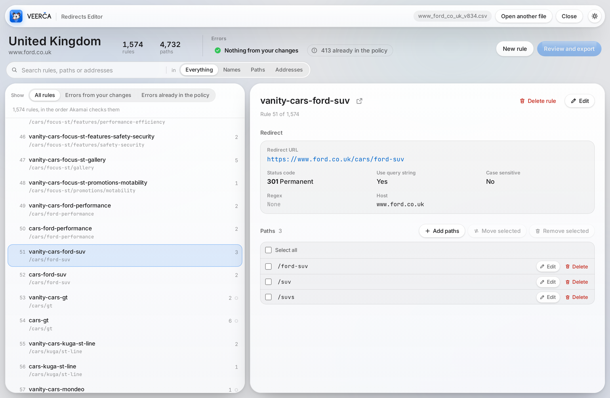

<p align="center">
  
</p>

<p align="center">
  <b>Open, check, edit and export Akamai Edge Redirector policies, right in the browser.</b><br>
  One HTML file &nbsp;·&nbsp; no backend &nbsp;·&nbsp; no dependencies &nbsp;·&nbsp; nothing leaves your computer
</p>

<p align="center">
  <a href="https://ACCOUNT.github.io/REPO/"><b>Open Veerča</b></a>
  &nbsp;·&nbsp;
  <a href="docs/VEERCA_user_guide.pdf">User guide (PDF)</a>
  &nbsp;·&nbsp;
  <a href="#security-and-privacy">Security and privacy</a>
</p>

<p align="center">
  
</p>

---

## What it is

Veerča is the redirects editor for our European market sites. It replaces Veera, the old redirects manager, which is being retired.

A redirect **policy** is the list of redirect rules for one site, such as www.ford.hu. The Akamai team keeps the live version. We ask them for the latest copy, open it in Veerča, make and check our changes, and send the exported file back. The Akamai team reviews it against changes from other teams and imports it. Veerča never connects to Akamai itself.

| | Who | Step |
|---|---|---|
| 1 | You | Ask the Akamai team for the latest policy for a market |
| 2 | Veerča | Open the zip or CSV they send |
| 3 | Veerča | Add, edit or remove rules and paths, and fix anything flagged as an error |
| 4 | Veerča | Review the changes, copy the summary, download the CSV |
| 5 | You | Email the CSV and the summary to the Akamai team, who import it |

## What it does

**Reads what we already use.** Akamai's own zip exports (`Policy46008Version329.zip`), the CSV inside them, and CSV files from Veera or Veerča. The market is recognised from the hostnames in the rules.

**Shows the whole policy.** Every rule in the order Akamai checks them, with search across rule names, paths and addresses, and filters for rules with problems. Any rule can also open on a page of its own in a new tab; all tabs stay in sync.

**Edits the way the team works.** Edit rules, add paths in bulk (paste a list, and full addresses become paths), select all, move paths between rules, and undo per rule. Moves are undone as moves, so paths never quietly disappear.

**Checks every change.** The whole policy is re-checked on each edit:

- duplicate rule names, which are never allowed
- paths that never take effect because an earlier rule already handles them
- redirect loops and redirect chains
- malformed paths and addresses, empty entries and repeated paths
- Akamai's limit of 8,192 characters of paths per rule, with a counter from 7,000

Many problems come with a one-click fix. Errors you introduce block export. Problems that were already in the file are shown but don't block it, except one rule over Akamai's size limit, because Akamai would refuse the whole file.

**Exports cleanly.** A plain-language summary of the changes for the email, a suggested file name such as `www_ford_hu_v330.csv`, and a CSV in the same format as Veera's export. Rules you didn't touch are written exactly as they were read.

**Keeps your work.** Every change is saved in your browser as you go. The start screen lists recent policies, one per market, so you can pick up where you left off.

## Using it

Open **https://ACCOUNT.github.io/REPO/** in a current version of Chrome or Edge. There's nothing to install and no account.

The [user guide](docs/VEERCA_user_guide.pdf) walks through everything with screenshots: opening a policy, reading rules, making changes, Akamai's size limit, rule pages, every check and what to do about it, and exporting.

## Security and privacy

Veerča is a static single-page application, delivered as one HTML file from GitHub Pages. All processing happens in the user's browser. There is no server component, no account, and no network request after the page has loaded.

### Architecture

- **One file.** The whole app is `index.html` (about 210 KB), with inline CSS and three inline scripts:
  - a tiny theme bootstrap;
  - the core, which holds parsing, the rule model, the checks, diffing and export as pure functions with no DOM access;
  - the user interface.
- **No third-party code.** No frameworks, libraries, CDNs, web fonts, analytics or trackers. Icons and the logo are inline SVG or `data:` URIs. The only other file the page refers to is `apple-touch-icon.png`, served from the same site.
- **Zip files** are unpacked in the browser with the built-in `DecompressionStream` API.

### Where data goes

| Step | What happens | Where the data is |
|---|---|---|
| Open | The file you choose or drop is read with the File API | In memory, in your browser |
| Work | The policy and your edits are kept in memory and saved to IndexedDB | This browser profile only |
| Export | The CSV is built in memory and downloaded through a `blob:` URL | Your downloads folder |
| Summary | Copied to the clipboard when you click Copy summary (write only, never read) | Your clipboard |

### What Veerča does not do

- Make network requests: no `fetch`, XHR, WebSocket, EventSource or beacons, and no uploads of any kind.
- Use cookies, accounts or authentication.
- Collect telemetry, analytics or error reports.
- Run dynamic code: no `eval`, no `new Function`, no remotely loaded scripts.
- Talk to Akamai or any other system.

### Browser storage

| Mechanism | Name | Contents | Kept until |
|---|---|---|---|
| IndexedDB | database `veerca`, store `policies` | Per market: the file as opened, the current working copy, the last export name, timestamps | Removed in the app (× or Clear all), or browser data is cleared |
| localStorage | `veerca-theme` | Light, dark or automatic appearance | Browser data is cleared |
| BroadcastChannel | `veerca` | Messages between open Veerča tabs: the working copy and recent-list updates | Only while tabs are open |
| URL fragment | e.g. `#open=www.ford.hu&rule=r12` | Market host and rule ID only, no policy content. Fragments are never sent to a server | Per tab |

All of these are limited to the site's origin and the user's browser profile. Nothing is shared between users.

### Handling file content

- **Policy files are treated as untrusted data.** Every value taken from a file is HTML-escaped by one helper, `esc()`, before it is inserted into the page.
- **Links.**
  - A redirect address is only shown as a link if it starts with `http://` or `https://`, so a file can't plant a `javascript:` link.
  - The market site link is always built as `https://` plus the host.
  - Both open in a new tab with `rel="noopener"`.
- **Nothing in a file is executed.** Files are processed in memory, and their size is bounded only by the browser's memory.
- **Export.** Every CSV cell is quoted, with quotes doubled, in UTF-8 with a byte-order mark. Cells are not altered to neutralise spreadsheet formulas, because the file must stay byte-compatible with what Akamai exports and imports. A cell starting with `=`, `+`, `-` or `@` can only come from the policy itself. Treat exported files in Excel as you would any file from Akamai.

### Hosting considerations (GitHub Pages)

- **Shared origin.** Project sites are served from `https://ACCOUNT.github.io/REPO/`. Browsers treat every Pages site under the same account as one origin, so another Pages site under the same account could read Veerča's IndexedDB and localStorage and listen on its BroadcastChannel.
  - Mitigation: host Veerča from a dedicated account or organisation, or behind a custom domain, and don't publish unrelated Pages sites alongside it.
- **Response headers.** GitHub Pages doesn't allow custom HTTP headers, so there's no header-based Content Security Policy or `X-Frame-Options`.
  - A CSP can be added as a `<meta>` tag. None is present today. A suitable policy would be along the lines of `default-src 'none'; script-src 'unsafe-inline'; style-src 'unsafe-inline'; img-src 'self' data:; connect-src 'none'; base-uri 'none'; form-action 'none'`.
  - `frame-ancestors` can't be set from a meta tag.
- **Repository contents.** The repository contains the app and its documentation only. Policy files must never be committed; the included `.gitignore` excludes `*.csv` and `*.zip`.
- **Updates.** A change to `index.html` reaches users within about ten minutes, which is GitHub Pages' cache time. Users can hard-refresh with Ctrl+Shift+R to get it straight away.

### Data sensitivity

Policies contain public URLs of public websites, redirect settings, and rule names, which may include internal ticket numbers. Veerča doesn't handle personal data.

### Known limitations

- **The recent list belongs to one browser profile on one computer.** It isn't encrypted beyond the protection the operating system and browser give the profile. On a shared computer, use Clear all when you're done, or a private window, where nothing is kept.
- **When two tabs change the same rule at the same moment, the last change wins.**
- **Browser support.** Developed and tested in current Chromium-based browsers (Chrome, Edge). Recent Firefox and Safari should work but aren't routinely tested.

## Development

Everything lives in `index.html`. To run it locally, open the file in a browser, or serve the folder:

```sh
python3 -m http.server 8080
# then open http://localhost:8080/
```

The core script (`<script id="core">`) has no DOM access. It can be evaluated on its own, for example in Node, to test parsing, checks and export against real policy files.

### Deploying

1. In the repository settings, open **Pages**, choose **Deploy from a branch**, and select `main` and `/ (root)`.
2. Push the updated `index.html`.
3. Wait a few minutes. Users who already have Veerča open should hard-refresh (Ctrl+Shift+R).

### File format

**Input.**
- Akamai zip exports.
- Akamai CSV exports, including the `#` header lines at the top.
- CSV files with the columns below, comma or semicolon separated. Files must be UTF-8; from Excel, use **Save As › CSV UTF-8**. Excel workbooks aren't accepted.

**Output.** The same layout as Veera's export:

```
ruleName,host,path,query,scheme,matchURL,regex,result.useIncomingQueryString,result.redirectURL,result.statusCode
```

- Paths are space-separated in the `path` cell, which can hold at most 8,192 characters.
- A leading `:` marks a case-sensitive rule.
- The trailing-slash rule is always written last.
- Akamai's `#` header lines aren't included.

## Project

| | |
|---|---|
| Owner | TEAM / CONTACT |
| Users | The digital editor team |
| Status | In use since October 2026, replacing Veera |
| Licence | Internal tool, not for redistribution |
